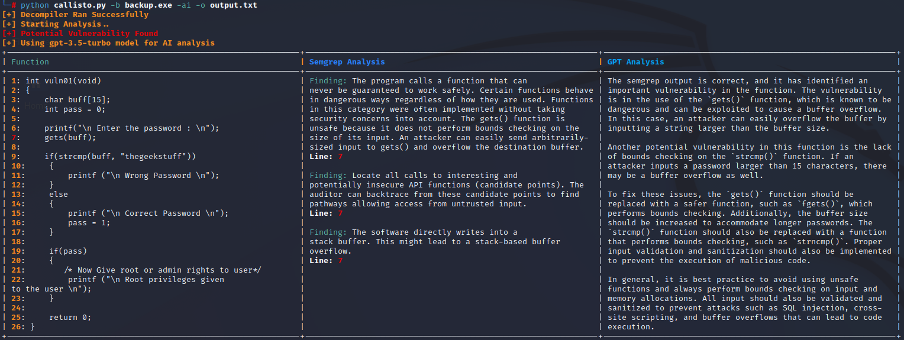

# Callisto
**An Intelligent Automated Binary Vulnerability Analysis Tool**

**Demo:**\

**Callisto** is an intelligent automated binary vulnerability analysis tool. Its purpose is to autonomously decompile a provided binary and iterate through the psuedo code output looking for potential security vulnerabilities in that pseudo c code. **Ghidra's** headless decompiler is what drives the binary decompilation and analysis portion. The pseudo code analysis is initially performed by the **Semgrep** SAST tool and then transferred to **GPT-3.5-Turbo** for validation of Semgrep's findings, as well as potential identification of additional vulnerabilities.

This tool's intended purpose is to assist with binary analysis and zero-day vulnerability discovery. The output aims to help the researcher identify potential areas of interest or vulnerable components in the binary, which can be followed up with dynamic testing for validation and exploitation. It certainly won't catch everything, but the double validation with Semgrep to GPT-3.5 aims to reduce false positives and allow a deeper analysis of the program.

For those looking to just leverage the tool as a quick headless decompiler, the `output.c` file created will contain all the extracted pseudo code from the binary. This can be plugged into your own SAST tools or manually analyzed.

I owe Marco Ivaldi [@0xdea](https://github.com/0xdea) a huge thanks for his publicly released custom Semgrep C rules as well as his idea to automate vulnerability discovery using semgrep and pseudo code output from decompilers. You can read more about his research here: [Automating binary vulnerability discovery with Ghidra and Semgrep](https://security.humanativaspa.it/automating-binary-vulnerability-discovery-with-ghidra-and-semgrep/)

**Requirements:**
- If you want to use the GPT-3.5-Turbo feature, you must create an API token on [OpenAI](https://platform.openai.com/account/api-keys) and save to the config.txt file in this folder
- [Ghidra](https://github.com/NationalSecurityAgency/ghidra)
- Semgrep - `pip install semgrep`
- requirements.txt - `pip install -r requirements.txt`
- Ensure the correct path to your Ghidra directory is set in the `config.txt` file

**To Run:**
`python callisto.py -b <path_to_binary> -ai -o <path_to_output_file>`
- `-ai` => enable OpenAI GPT-3.5-Turbo Analysis. Will require placing a valid OpenAI API key in the config.txt file
- `-o` => define an output file, if you want to save the output
- `-ai` and `-o` are optional parameters
- Ex. `python callisto.py -b vulnProgram.exe -ai -o results.txt`

**Program Output Example:**\

